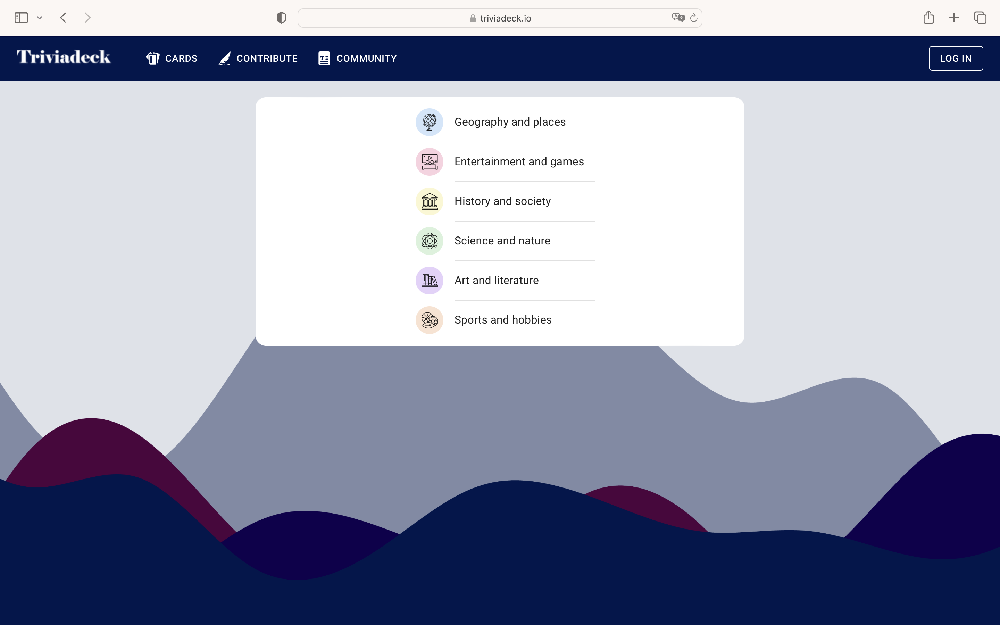

# Triviadeck
### *A trivia app in the Trivial Pursuit format*
 

[triviadeck.io](https://triviadeck.io)

Triviadeck is a web app built with `gatsbyjs`, `react`, `graphql` and `firestore`. It provides trivia questions in the Trivial Pursuit format from a database of ~50000 question-answer pairs in six categories. Users can rate questions as well as add new ones. Questions without categories in source data are automatically categorized using the Wikipedia category graph as explained in [this repo](https://github.com/fvlo/wikipedia-categories).

The frontend is built using the gatsby react framework. Authentication and site analytics are implemented using gatsby plugins. Database calls are done via a graphql server built with Apollo.

The backend is built on GCP using a serverless architecture. Firebase is used for authentication backend, data is stored in nosql firestore and database operations are done using cloud functions.

✅ 📝 *Triviadeck was built in 2021. This is a public partial copy of the repos for the archives.*